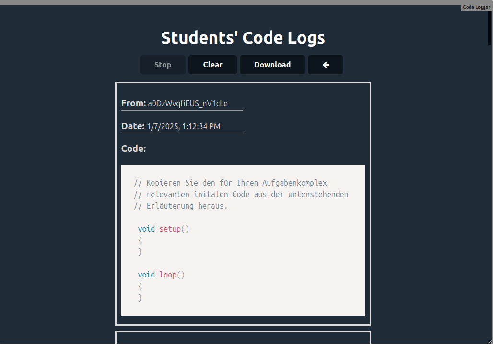

# Module Code Logger

A teacher can add this module to their course to monitor the code executed by the students in the code editor. The code is immedietly stored in IndexedDB and can be viewed by the teacher at any time.



# Usage

Import the module into your classroom, with the following url:

```html
https://edrys-labs.github.io/module-code-logger/
```
